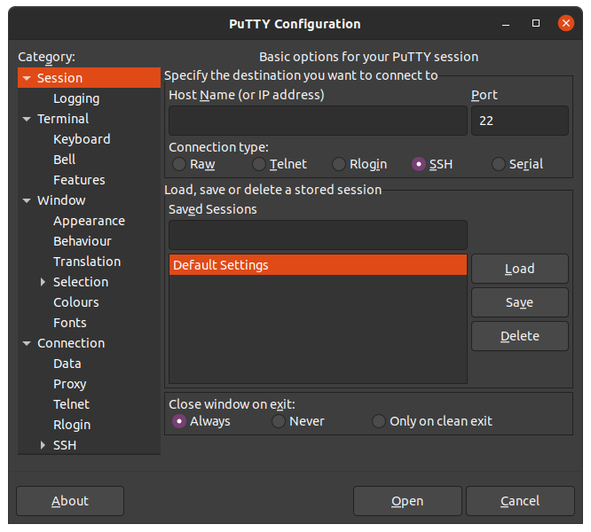

# Execução do projeto
Há duas formas de executar o projeto. A primeira demanda que um servidor seja instalado e configurado na máquina. As etapas para configurar o Apache estão descritas abaixo. Outra opção é acessar a máquina virtual criada, em que o servidor já está instalado. Para acessar o projeto na máquina virtual basta clicar [aqui](http://104.41.25.156/front/). Para acessar os arquivos dentro da máquina virtual basta seguir os passos descritos [no fim desse documento](https://github.com/EMAp-EDA-2021/final-project-grupo-2/blob/main/auxiliares/servidor.md#máquina-virtual).


# Instalação do servidor local 

Para a execução correta do projeto, é necessária a instalação e configuração de um servidor com suporte de execução de scripts. Esse breve tutorial explica como instalar e configurar o Apache para executar scripts cgi no linux.

> Obs: Esses passos foram testados no Ubuntu 20.04

## Usando DOCKER

Basta rodar os seguintes comandos no terminal.

### Instalando o DOCKER
> Você pode pular esta etapa se já tiver instalado em sua máquina.

- Atualizando o repositório local
```s
sudo apt update
```
- Instalando o DOCKER
```s
sudo apt install docker.io
```
- Conferindo a instalação
```s
docker --version
```
A saída espera será semelhante a esta:
```s
Docker version 20.10.7, build 20.10.7-0ubuntu5~20.04.2
```
A partir daqui se tudo correr bem teremos o DOCKER instalado com sucesso na máquina.

### Iniciando o container
- Primeiro se constrói a imagem
```s
sudo docker build -t waze2:latest .
```
- Agora rodamos o container
```s
sudo docker run --name waze-container --rm -p 80:80 waze2:latest
```
- Podemos acessar o projeto no seguinte caminho
```s
http://localhost/front/
```
-- Caso necessário você pode parar o container com o seguinte comando
```s
sudo docker stop waze-container
```

## Instação do Apache

```s
sudo apt update

sudo apt install apache2
```

## Ajustando o Firewall 

```s
sudo ufw allow 'Apache'
```

Após esse passo pode-ser verificar as permissões executando:

```s
sudo ufw status
```

A saída esperada deve ser:
```s
To                         Action      From
--                         ------      ----
Apache                     ALLOW       Anywhere   
Apache (v6)                ALLOW       Anywhere (v6)   
```

## Verifique a instalação

Execute:

```s
sudo systemctl status apache2
```

A saída esperada deve ser:
```s
● apache2.service - The Apache HTTP Server
     Loaded: loaded (/lib/systemd/system/apache2.service; enabled; vendor preset: enabled)
     Active: active (running) since Thu 2020-04-23 22:36:30 UTC; 20h ago
       Docs: https://httpd.apache.org/docs/2.4/
   Main PID: 29435 (apache2)
      Tasks: 55 (limit: 1137)
     Memory: 8.0M
     CGroup: /system.slice/apache2.service
             ├─29435 /usr/sbin/apache2 -k start
             ├─29437 /usr/sbin/apache2 -k start
             └─29438 /usr/sbin/apache2 -k start 
```

Por fim, verifique o funcionamento do apache acessando http://ip_do_seu_servidor no navegador.
Caso não saiba seu IP, basta executar:

```s
hostname -I
```

Você deve ver a página index padrão do Apache. 

## Configurando o Virtual Host

Vá para o diretório de arquivos do Apache e clone o projeto:

```s
cd /var/www/

git clone https://github.com/EMAp-EDA-2021/final-project-grupo-2.git
```

Para editar arquivos do projeto clonado, é necessário dar permissões ao seu usuário:

> Troque *user* pelo seu usuário

```s
sudo chown -R user final-project-grupo-2 
```

## Configure o projeto

Crie e acesse o arquivo de configuração do projeto:

```s
sudo nano /etc/apache2/sites-available/final-project-grupo-2.conf
```

Cole as configurações:

```s
<VirtualHost *:80>
    ServerAdmin webmaster@localhost
    ServerName final-project-grupo-2
    ServerAlias www.final-project-grupo-2
    DocumentRoot /var/www/final-project-grupo-2
    ErrorLog ${APACHE_LOG_DIR}/error.log
    CustomLog ${APACHE_LOG_DIR}/access.log combined
</VirtualHost>
```

Habilite o arquivo criado e desabilite o arquivo default do Apache:

```s
sudo a2ensite final-project-grupo-2.conf

sudo a2dissite 000-default.conf
```
Verfique a configuração:
```s
sudo apache2ctl configtest
```

O Output desejado:

```s
Output
Syntax OK
```

Por fim, reinicie o Apache:

```s
sudo systemctl restart apache2
```

## Configuração do CGI

Essa é a última e mais importante etapa de configuração do servidor. 
Primeiramente, habilite o módulo para cgi e reinicie o Apache:

```s
sudo a2enmod cgid

systemctl restart apache2
```

Agora, habilite a execução de scripts no diretório do projeto. 
Abra o arquivo de configurações do Apache:

```s
sudo nano /etc/apache2/conf-available/cgi-enabled.conf
```

Cole as configurações:

```s
<Directory "/var/www/files/backend">
    Options +ExecCGI
    AddHandler cgi-script .cgi .pl .py .rb
</Directory>

<Directory "/var/www/files/front">
    Options +ExecCGI
    AddHandler cgi-script .cgi .pl .py .rb
</Directory>
```

Ative a configuração e reinicie o servidor:

```s
sudo a2enconf cgi-enabled

systemctl restart apache2
```

Por fim, habilite o programa:

```s
sudo chmod 755 /var/www/files/backend/main.cgi
```

## Observação
Caso sejam feitas alterações em arquivos do backend, será necessário recompliar o programa através do comando:

```s
g++ -O main.cpp -o main.cgi
```

Com isso, a aplicação deve funcionar normalmente. 
Caso haja algum problema, foi criada uma máquina virtual em que o programa funciona corretamente. 

# Máquina Virtual

É muito simples acessar a máquina tanto do linux quanto do Windows. Para ambos os sistemas, instala-se um programa chamado Putty. Seguem os passos a serem executados no linux:

## Instalando o Putty

Instale o programa:
```s
sudo apt-get update

sudo apt-get install -y putty
```
Acesse o Putty:

```s
putty
```

Deve aparecer uma nova janela, solicitando um Host Name ou IP:



Digite o IP:  `104.41.25.156`

O login e a senha foram enviados por email, junto com a entrega do trabalho, por razões de segurança. Após fazer login deve ser ver:


Agora basta segui para o diretório `cd /var/www/final*` e terá acesso aos arquivos dentro do servidor em funcionamento.

A máquina foi configurada como descrito acima e o acesso aos arquivos pode ser feito utilizando o comando `nano`. 

O git está instalado na máquina. É necessário utilizar `sudo`  para executar comandos do git. 

Pode-se acessar a página clicando [aqui](http://104.41.25.156/front/).

